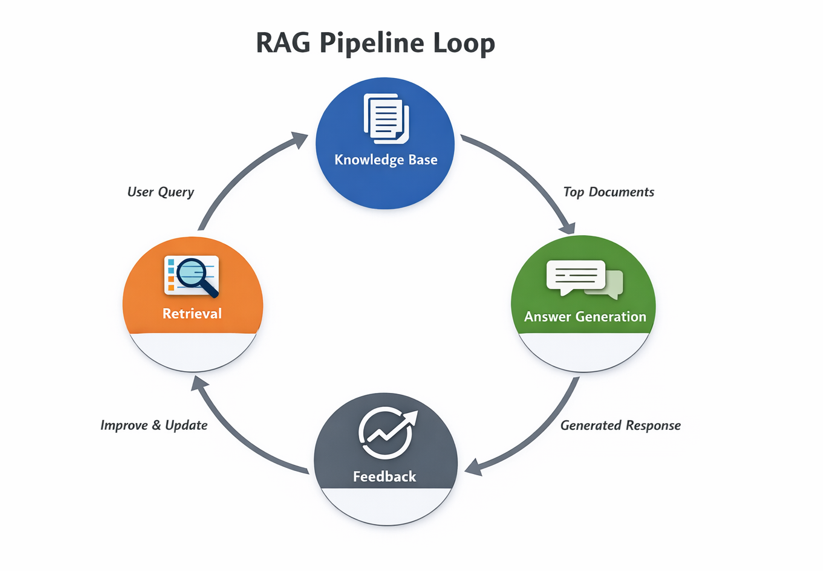
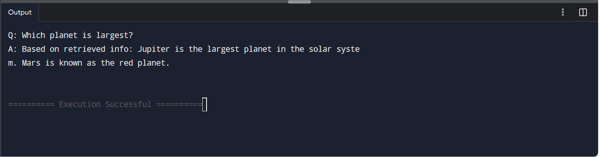

# Understanding RAG

## Prerequisites
Python 3.9 and above

## Install dependencies
pip install -r requirements.txt

## Execute the python file "rag.py"
python3 .\rag.py

## Output
Q: Which planet is largest?
A: Based on retrieved info: Jupiter is the largest planet in the solar system. Mars is known as the red planet.

### Note
For more detailed understang refer below blog:
https://huggingface.co/blog/ngxson/make-your-own-rag
